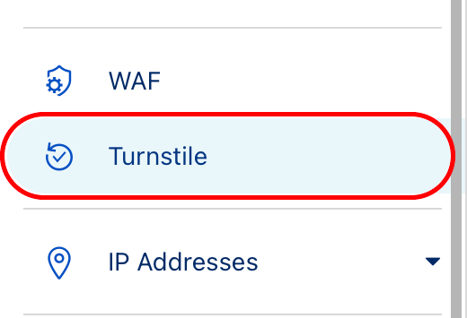
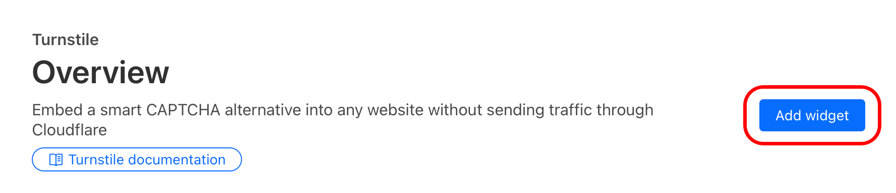
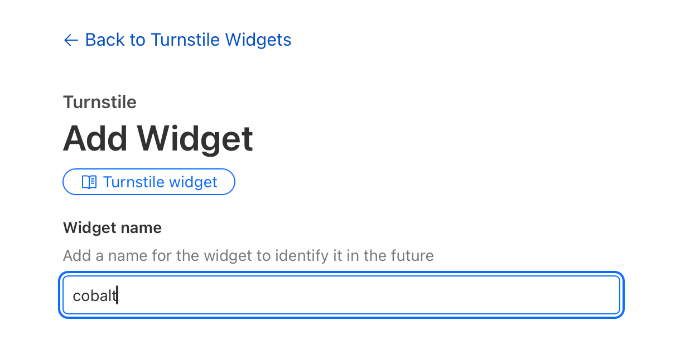
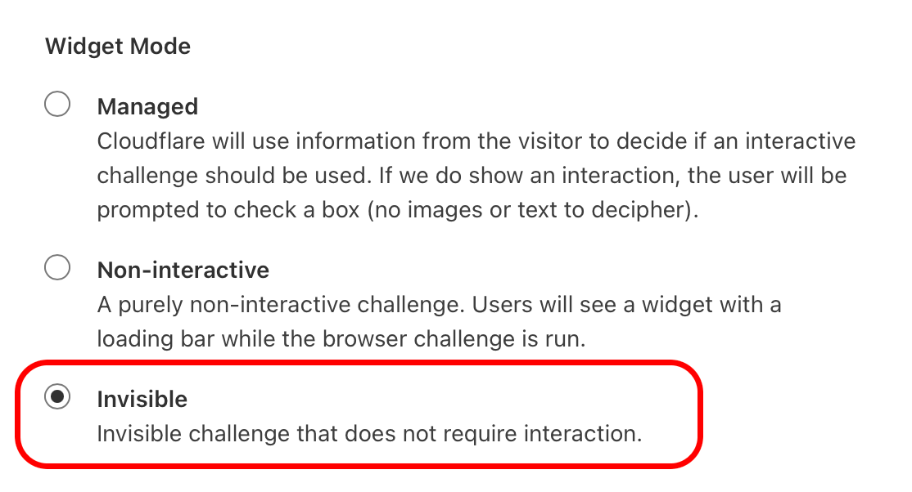

# how to protect your cobalt instance
if you keep getting a ton of unknown traffic that hurts the performance of your instance, then it might be a good idea to enable bot protection.

> [!NOTE]
> this tutorial will work reliably on the latest official version of cobalt 10.
we can't promise full compatibility with anything else.

## configure cloudflare turnstile
turnstile is a free, safe, and privacy-respecting alternative to captcha.
cobalt uses it automatically to weed out bots and automated scripts.
your instance doesn't have to be proxied by cloudflare to use turnstile.
all you need is a free cloudflare account to get started.

cloudflare dashboard interface might change over time, but basics should stay the same.

> [!WARNING]
> never share the turnstile secret key, always keep it private. if accidentally exposed, rotate it in widget settings.

1. open [the cloudflare dashboard](https://dash.cloudflare.com/) and log into your account

2. once logged in, select `Turnstile` in the sidebar
<div align="left">
    <p>
        
    </p>
</div>

3. press `Add widget`
<div align="left">
    <p>
        
    </p>
</div>

4. enter the widget name (can be anything, such as "cobalt")
<div align="left">
    <p>
        
    </p>
</div>

5. add cobalt frontend domains you want the widget to work with, you can change this list later at any time
    - if you want to use your processing instance with [cobalt.tools](https://cobalt.tools/) frontend, then add `cobalt.tools` to the list
<div align="left">
    <p>
        
    </p>
</div>

6. select `invisible` widget mode
<div align="left">
    <p>
        
    </p>
</div>

7. press `create`

8. keep the page with sitekey and secret key open, you'll need them later.
if you closed it, no worries!
just open the same turnstile page and press "settings" on your freshly made turnstile widget.

<div align="left">
    <p>
        
    </p>
</div>

you've successfully created a turnstile widget!
time to add it to your processing instance.

### enable turnstile on your processing instance
this tutorial assumes that you only have `API_URL` in your `environment` variables list.
if you have other variables there, just add new ones after existing ones.

> [!CAUTION]
> never use any values from the tutorial, especially `JWT_SECRET`!

1. open your `docker-compose.yml` config file in any text editor of choice.
2. copy the turnstile sitekey & secret key and paste them to their respective variables.
`TURNSTILE_SITEKEY` for the sitekey and `TURNSTILE_SECRET` for the secret key:
```yml
environment:
    API_URL: "https://your.instance.url.here.local/"
    TURNSTILE_SITEKEY: "2x00000000000000000000BB" # use your key
    TURNSTILE_SECRET: "2x0000000000000000000000000000000AA" # use your key
```
3. generate a `JWT_SECRET`. we recommend using an alphanumeric collection with a length of at least 64 characters.
this string will be used as salt for all JWT keys.

    you can generate a random secret with `pnpm -r token:jwt` or use any other that you like.

```yml
environment:
    API_URL: "https://your.instance.url.here.local/"
    TURNSTILE_SITEKEY: "2x00000000000000000000BB" # use your key
    TURNSTILE_SECRET: "2x0000000000000000000000000000000AA" # use your key
    JWT_SECRET: "bgBmF4efNCKPirD" # create a new secret, NEVER use this one
```
4. restart the docker container.

## configure api keys
if you want to use your instance outside of web interface, you'll need an api key!

> [!NOTE]
> this tutorial assumes that you'll keep your keys file locally, on the instance server.
> if you wish to upload your file to a remote location,
> replace the value for `API_KEYS_URL` with a direct url to the file
> and skip the second step.

> [!WARNING]
> when storing keys file remotely, make sure that it's not publicly accessible
> and that link to it is either authenticated (via query) or impossible to guess.
>
> if api keys leak, you'll have to update/remove all UUIDs to revoke them.

1. create a `keys.json` file following [the schema and example down below](#api-key-file-format).

2. expose the `keys.json` to the docker container:
```yml
volumes:
    - ./keys.json:/keys.json:ro # ro - read-only
```

3. add a path to the keys file to container environment:
```yml
environment:
    # ... other variables here ...
    API_KEY_URL: "file:///keys.json"
```

4. restart the docker container.

## limit access to an instance with api keys but no turnstile
by default, api keys are additional, meaning that they're not *required*,
but work alongside with turnstile or no auth (regular ip hash rate limiting).

to always require auth (via keys or turnstile, if configured), set `API_AUTH_REQUIRED` to 1:
```yml
environment:
    # ... other variables here ...
    API_AUTH_REQUIRED: 1
```

- if both keys and turnstile are enabled, then nothing will change.
- if only keys are configured, then all requests without a valid api key will be refused.

### why not make keys exclusive by default?
keys may be useful for going around rate limiting,
while keeping the rest of api rate limited, with no turnstile in place.

## api key file format
the file is a JSON-serialized object with the following structure:
```typescript

type KeyFileContents = Record<
    UUIDv4String,
    {
        name?: string,
        limit?: number | "unlimited",
        ips?: (CIDRString | IPString)[],
        userAgents?: string[]
    }
>;
```

where *`UUIDv4String`* is a stringified version of a UUIDv4 identifier.
- **name** is a field for your own reference, it is not used by cobalt anywhere.

- **`limit`** specifies how many requests the API key can make during the window specified in the `RATELIMIT_WINDOW` env.
    - when omitted, the limit specified in `RATELIMIT_MAX` will be used.
    - it can be also set to `"unlimited"`, in which case the API key bypasses all rate limits.

- **`ips`** contains an array of allowlisted IP ranges, which can be specified both as individual ips or CIDR ranges (e.g. *`["192.168.42.69", "2001:db8::48", "10.0.0.0/8", "fe80::/10"]`*).
    - when specified, only requests from these ip ranges can use the specified api key.
    - when omitted, any IP can be used to make requests with that API key.

- **`userAgents`** contains an array of allowed user agents, with support for wildcards (e.g. *`["cobaltbot/1.0", "Mozilla/5.0 * Chrome/*"]`*).
    - when specified, requests with a `user-agent` that does not appear in this array will be rejected.
    - when omitted, any user agent can be specified to make requests with that API key.

- if both `ips` and `userAgents` are set, the tokens will be limited by both parameters.
- if cobalt detects any problem with your key file, it will be ignored and a warning will be printed to the console.

an example key file could look like this:
```json
{
    "b5c7160a-b655-4c7a-b500-de839f094550": {
        "limit": 10,
        "ips": ["10.0.0.0/8", "192.168.42.42"],
        "userAgents": ["*Chrome*"]
    },
    "b00b1234-a3e5-99b1-c6d1-dba4512ae190": {
        "limit": "unlimited",
        "ips": ["192.168.1.2"],
        "userAgents": ["cobaltbot/1.0"]
    }
}
```

if you are configuring a key file, **do not use the UUID from the example** but instead generate your own. you can do this by running the following command if you have node.js installed:
`node -e "console.log(crypto.randomUUID())"`
