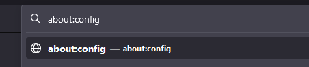
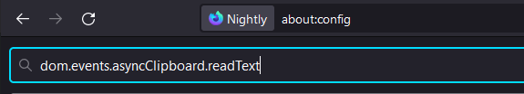
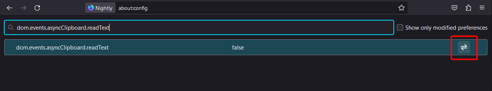
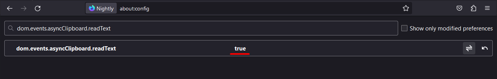

# self-troubleshooting cobalt
```
🚧 this page is work-in-progress. expect more guides to be added in the future!
```
if any issues occur while using cobalt, you can fix many of them yourself. this document aims to provide guides on how to fix most complicated of them.  
use wiki navigation on right to jump between solutions.  

## how to fix clipboard pasting in older versions of firefox
```
🎉 firefox finally supports pasting by default starting from version 125.

👍 you don't need to follow this tutorial if you're on the latest version of firefox.
```
you can fix this issue by changing a single preference in `about:config`.

### steps to enable clipboard functionality
1. go to `about:config`:  
     

2. if asked, read what firefox has to say and press "accept the risk and continue".  
 ⚠ tinkering with other preferences may break your browser. **do not** edit them unless you know what you're doing.   

     

3. search for `dom.events.asyncClipboard.readText`  

   

4. press the toggle button on very right.  

   

5. "false" should change to "true".  

   

6. go back to cobalt, reload the page, press `paste` button again. this time it works! enjoy simpler downloading experience :)
